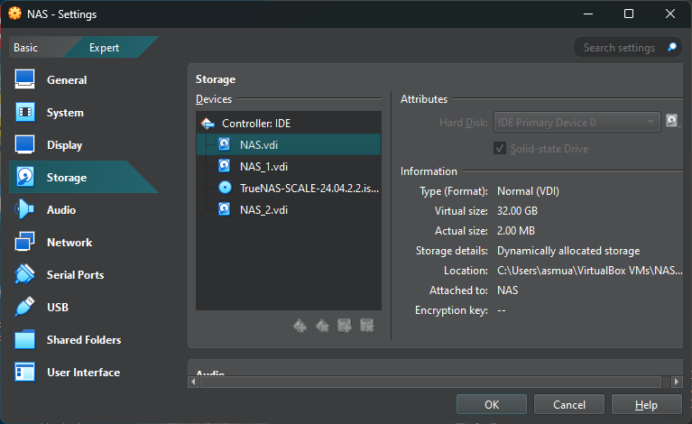

# Setup TrueNAS Scale di VirtualBox + Nextcloud + Jellyfin

## Prasyarat
Sebelum memulai, pastikan Anda memiliki:
1. **VirtualBox** terinstal di sistem Anda [situs resmi VirtualBox](https://www.virtualbox.org/).
2. **ISO TrueNAS Scale** yang dapat diunduh dari [situs resmi TrueNAS](https://www.truenas.com/download-truenas-scale/).
3. Ruang disk di:
   - **SSD (C:/)** untuk OS TrueNAS.
   - **HDD (D:/)** untuk media dan file.

*tidak harus sama

## Langkah-langkah Setup

### 1. Membuat Mesin Virtual di VirtualBox

1. **Buka VirtualBox** dan klik pada **"New"**.
2. Isi informasi berikut:
   - **Name**: TrueNAS
   - **Type**: BSD
   - **Version**: FreeBSD (64-bit)
3. Klik **Next**.
4. Tentukan **Memory Size**: 4 GB cukup akan tetapi 8 GB disarankan TrueNAS.
5. Klik **Next**.
6. Pada bagian **Hard Disk**:
   - Pilih **"Create a virtual hard disk now"** dan klik **Create**.
   - Pilih **VHD (Virtual Hard Disk) / VDI (Virtual Disk Image)** dan klik **Next**.
   - Pilih **Dynamically allocated** dan klik **Next**.
   - Tentukan ukuran disk (minimal 20 GB) dan set sebagai SSD.
   - Klik **Create**.

### 2. Menambahkan Penyimpanan untuk Media

1. Di jendela VirtualBox, pilih mesin virtual TrueNAS yang baru dibuat dan klik **Settings**.
2. Pilih tab **Storage**.
3. Klik pada **Controller: SATA** dan kemudian klik pada ikon **disk** dengan tanda plus (+).
4. Pilih **"Add Hard Disk"** dan klik **Create New Disk**.
   - Pilih **VHD (Virtual Hard Disk) / VDI (Virtual Disk Image)**,
   - Tentukan ukuran disk (sesuai kebutuhan) dan set sebagai HDD.
5. Klik **OK** untuk menyimpan pengaturan.

Hasil akhir pengaturan Penyimpanan seperti berikut:


*dalam pengaturan tersebut 
- NAS untuk OS *check as SSD
- NAS_1 sbg HDD-1
- NAS_2 sbg HDD-2

### 3. Menginstal TrueNAS Scale

1. Pilih mesin virtual TrueNAS dan klik **Start**.
2. Pilih file ISO TrueNAS Scale yang telah diunduh.
3. Ikuti petunjuk instalasi:
   - Pilih **"Install/Upgrade"**.
   - Setujui perjanjian lisensi.
   - Pilih disk untuk instalasi (SSD di C:/).
   - Ikuti langkah-langkah hingga selesai (next2 saja) dan reboot.

### 4. Konfigurasi Awal TrueNAS

1. Setelah reboot, catat alamat IP yang ditampilkan.
2. Buka browser dan akses alamat IP tersebut.
3. Ikuti wizard konfigurasi:
   - Buat **admin account**.
   - Atur penyimpanan:
     - Pilih disk yang dialokasikan di D:/ untuk data/media.
     - Buat **Pool** baru dan atur dataset sesuai kebutuhan.
4. Tambah dataset children seperti **app_data** (sebagai tempat data aplikasi seperti nextcloud/jellyfin), gunakan share type `Apps` daripada `Generic`
![Pengaturan dataset]
5. Ubah permission **app_data** dan dataset2 didalamnya agar dapat diakses aplikasi dengan menambahkan User - Apps dan Group - Apps 


*pembuatan dataset tambahan bersifat opsional


### 5. Menambahkan Plugin/Library Populer

1. **Nextcloud**: Untuk personal drive.
   - Masuk ke bagian **Apps** dan pilih **Available Apps**.
   - Cari **Jellyfin** dan instal.
   - Ikuti instruksi untuk konfigurasi awal.
   - Buat Dataset sesuai dengan kebutuhan pada dataset app_data -> jellyfin -> (dataset sesuai kebutuhan)
   - pastikan instalasi dilakukan di dataset yang sudah dibuat daripada bawaan iXsystem 
   - dataset yang diperlukan : 
      - appdata
      - userdata
      - pgdata
      - pgbackup


2. **Jellyfin**: Untuk media server.
   - Masuk ke bagian **Apps** dan pilih **Available Apps**.
   - Cari **Jellyfin** dan instal.
   - Ikuti instruksi untuk konfigurasi awal.
   - Buat Dataset sesuai dengan kebutuhan pada dataset app_data -> jellyfin -> (dataset sesuai kebutuhan)
   - pastikan instalasi dilakukan di dataset yang sudah dibuat daripada bawaan iXsystem
   - dataset yang diperlukan : 
      - cache
      - config
      - transcode
      - userdata nextcloud (add additional storage dengan path userdata yang telah dibuat untuk nextcloud)

*bisa juga menggunakan default ixVolume namun perlu penyesuaian untuk userdata nextcloud yang dipass ke jellyfin

### 6. Mengakses Drive Secara Lokal

- Akses file di media server melalui alamat IP yang sama di browser atau menggunakan aplikasi yang relevan (seperti Jellyfin client).
- Akses file dari Nextcloud menggunakan browser di alamat IP dan port yang ditentukan.

### 7. Mengakses Drive dari Jaringan Eksternal

Untuk mengakses dari luar jaringan:

Opsi 1. **Serveo** atau **Localtunnel**:
   - Gunakan terminal untuk membuat tunneling. Contoh:
     ```bash
     ssh -R 80:localhost:80 serveo.net
     ```
   - Anda akan mendapatkan URL yang dapat diakses dari luar untuk layanan yang diinginkan.
   *perlu membuat kode untuk eksekusi perintah setiap kali menjalankan / terdapat error pada serveo / localtunnel

Opsi 2. **Cloudflare Tunnel**:

   ***Prasyarat***
   1. domain
   2. akun cloudflare ✅free tier

   ***Langkah2***
   1. set up cloudflare sesuai petunjuk
   2. install cloudflare pada truenas sesuai petunjuk


### 8. Uji Sinkronisasi dan Streaming

- **Sinkronisasi**: Upload file musik, video, dan dokumen ke Nextcloud. Uji akses dari perangkat lain.
- **Streaming**: Gunakan aplikasi Jellyfin untuk streaming musik dan video dari perangkat lain di jaringan.

## Catatan untuk Penggunaan di Mini PC atau Dedicated Server

- **Kinerja**: Jika menggunakan mini PC atau server khusus, pastikan spesifikasi cukup untuk mendukung TrueNAS dan aplikasi yang dijalankan.
- **Pengaturan Jaringan**: Pastikan konfigurasi jaringan (IP static, port forwarding) dilakukan dengan benar agar akses luar jaringan berjalan lancar.

Selamat mencoba! Jika ada pertanyaan lebih lanjut, jangan ragu untuk bertanya.